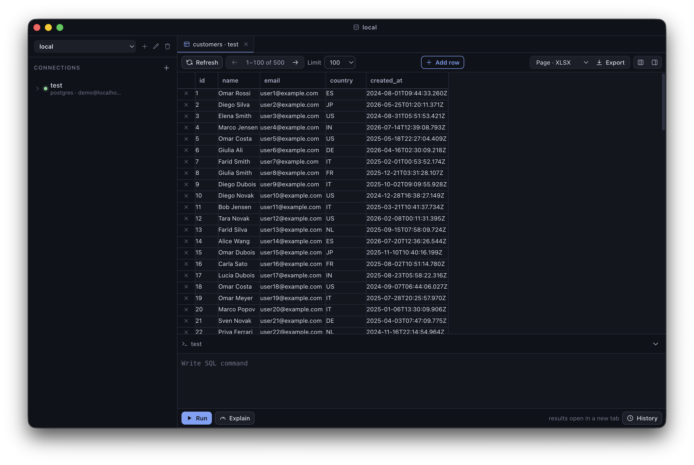

<h1 align="center">🗄️ Hopper</h1>

<p align="center">
  <em>A desktop database client for databases that are a little hard to reach.</em>
</p>

<p align="center">
  
  
  
  
  
  
</p>

---

<p align="center">
  
</p>

Most database GUIs assume your database is just… *there*. Mine never is. It sits behind a
`kubectl port-forward`, or an SSH hop into a devcontainer.

So this one runs **your pre-connection script for you**, waits until it's actually ready,
and only then opens the connection.

The UI is deliberately simple. It's built for the everyday administrative stuff (running
selects, updating a few rows, dumping a table to `.csv`), not for being a full-blown IDE.

## ✨ What it does

🔌 **Connects through anything.** Give a connection a bash script and a "ready" regex. The
script runs in its own process group, output streams to a live console, and the app waits
for the match (or a timeout) before dialing the DB. Two friendlier presets, `kubectl` and
`ssh-devcontainer`, generate that script from a few fields and pick a **fresh free local
port on every connect**, so nothing ever clashes and two connections can be live at once.

💚 **Heals itself.** Tunnel died? Laptop slept? A 20s health-check notices, and the
connection retries with backoff, re-running the pre-script and grabbing a new port each
attempt. You get a toast, not a mystery.

🌳 **Browses your schema.** Schemas → tables & views in the sidebar, with a right rail that
shows columns, indexes, foreign keys and copy-pasteable DDL.

📊 **Edits like a spreadsheet.** Click a cell, type, done, written back as a
primary-key-targeted, parameterized `UPDATE`. Insert and delete rows, drag out a rectangular
selection, ⌘C it as TSV (header row included). Cells with a foreign key grow a little follow
button that jumps you to the referenced row. No primary key? The grid stays read-only, on
purpose.

⌨️ **Speaks SQL.** Query tabs with autocomplete (tables, columns, aliases, scoped to your
`FROM`), ⌘↵ to run the statement under the caret, ⌘⇧↵ for the whole editor, and a one-click
`EXPLAIN`.

🗂️ **Keeps things tidy.** Workspaces group connections, per-connection query history is
pinnable and nameable, and there's a **read-only** toggle for the connections you'd rather
not break. Plus pagination, sorting, per-column filters, CSV export, color tags and a
latency-reporting connection test.

🔐 **Keeps secrets secret.** Passwords are encrypted at rest with the OS keychain
(Electron `safeStorage`) and never cross into the renderer.

## 💻 Platforms

| | Status |
|---|---|
| **macOS** (Apple Silicon) | Supported — `dmg` + `zip` |
| **Linux** (x64 / arm64) | Supported — `AppImage` + `deb` |
| **Windows** | Not supported |

Windows isn't just a missing build target: pre-connection scripts are spawned as
`bash -lc` in their own process group and torn down with a negative-PID group kill, and
the generated `kubectl` / `ssh-devcontainer` scripts are POSIX-shell quoted. All three
would need a Windows path before a build would be worth shipping.

On Linux, a few things to know:

- **Passwords need a keyring.** `safeStorage` reports itself as available even with no
  secret store, but then "encrypts" with a hardcoded password. Install `gnome-keyring`
  or `kwallet` (the `.deb` recommends `libsecret-1-0`); without one the app logs a
  warning at startup and your saved passwords are effectively plaintext.
- **`bash` must be on `PATH`**, along with whatever your pre-connection scripts call
  (`kubectl`, `ssh`, …). Scripts run through a login shell, so they see your `~/.profile`.
- **AppImage users get a cleaned environment.** The AppImage runtime points
  `LD_LIBRARY_PATH` and friends at its own bundled libraries; those are restored to their
  pre-launch values for spawned scripts, so `kubectl` and `ssh` load system libs and don't
  die on a glibc/OpenSSL mismatch.
- Window controls are drawn by the desktop over the app's own title bar
  (`titleBarOverlay`), and ⌘ shortcuts are Ctrl shortcuts.

## 🧰 Tech

- **Electron main** (Node) with `pg` and `mysql2` behind one small `Driver` interface
  (`src/main/db`). Adding an engine means implementing that interface.
- **Typed IPC** over a `contextBridge` preload (`window.api`), `contextIsolation` on.
- **React + Zustand** renderer with a hand-rolled data grid, no heavyweight grid dependency.

## 🚀 Develop

```bash
npm install
npm run dev        # Electron window with HMR
npm run typecheck  # tsc for main+preload and renderer
npm run build      # production build into out/
```

Need something to point it at? There are two throwaway seeded databases in `docker/`:

```bash
npm run testdb:up     # postgres on :55432, mysql on :33060 (demo/demo)
npm run testdb:down
```

## 📦 Build an app

```bash
npm run build:mac    # -> dist/Hopper-<version>-arm64.dmg (+ .zip)
npm run build:linux  # -> dist/Hopper-<version>-{x64,arm64}.AppImage (+ .deb)
```

The macOS build is ad-hoc signed (no Apple Developer ID), so it only runs on the machine
that made it. Linux packages are unsigned and need no notarisation dance.

Both builds are pure JS end to end (`pg`, `mysql2` and `xlsx` need no native rebuild), so
either target cross-builds for the other architecture. Producing a `.deb` or `.AppImage`
does need Linux packaging tools, though — run `build:linux` on Linux, or in
electron-builder's Docker image. `npm run pack:linux` makes an unpacked directory anywhere.

## 🗺️ Layout

```
src/
  main/       Electron main: ipc, stores, pre-script runner, DB drivers
  preload/    contextBridge API surface (window.api)
  shared/     types shared across main/preload/renderer
  renderer/   React UI (components, zustand store, styles)
```

## 🛡️ Security notes

- Passwords never reach the renderer (only `hasPassword`) and are never logged.
- All SQL uses bound parameters; identifiers are quoted per driver.
- Pre-connection scripts run in **your** shell with **your** environment, so treat saved
  connection files as trusted input.

## 📄 License

MIT - see [LICENSE](LICENSE).
